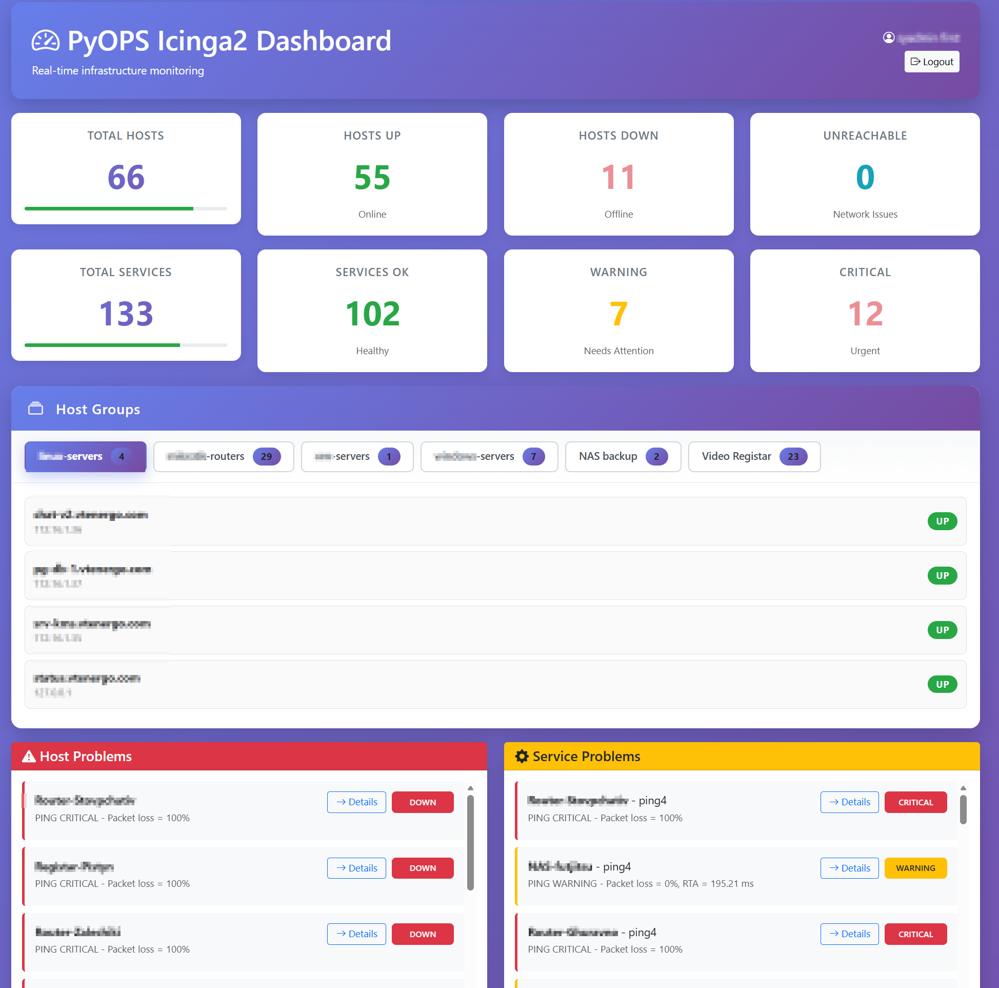

# Icinga2 Flask Dashboard



A beautiful and responsive monitoring dashboard for Icinga2 using Flask and the Icinga2 API with Active Directory authentication.

## Features

- 🎨 Modern, responsive UI with real-time updates
- 🔐 Active Directory (LDAP) authentication
- 📊 Host and service statistics overview
- 🚨 Problem alerts for hosts and services
- 🔄 Auto-refresh every 30 seconds
- 📱 Mobile-friendly design
- 🎯 Clean and intuitive interface
- 👤 User session management

## Installation

### Quick Start (Development)

1. Clone or navigate to this directory

2. Install Python dependencies:
```bash
pip install -r requirements.txt
```

3. Configure your settings - copy `.env.example` to `.env` and edit

4. Run the application:

**Development server:**
```bash
python app.py
```

**Production with Gunicorn:**
```bash
gunicorn --config gunicorn_config.py app:app
```

Access at `http://localhost:5000`

### Gunicorn Configuration

The `gunicorn_config.py` file includes production-ready settings:
- **Workers**: Auto-calculated (2 × CPU cores + 1)
- **Bind**: `0.0.0.0:5000`
- **Timeout**: 30 seconds
- **Logging**: stdout/stderr for systemd

**Gunicorn command examples:**
```bash
# Basic
gunicorn app:app

# Custom workers and port
gunicorn --workers 4 --bind 0.0.0.0:8000 app:app

# With config file (recommended)
gunicorn --config gunicorn_config.py app:app
```

### Environment Configuration

3. Configure your settings:
   - Copy `.env.example` to `.env`:
     ```bash
     cp .env.example .env
     ```
   - Edit `.env` and add your configuration:
     ```
     # Icinga2 API
     ICINGA_URL=https://your-icinga-server:5665
     ICINGA_USER=your-api-username
     ICINGA_PASSWORD=your-api-password
     
     # Active Directory/LDAP
     LDAP_SERVER=dc.company.local
     LDAP_PORT=389
     LDAP_USE_SSL=false
     LDAP_DOMAIN=COMPANY
     LDAP_BASE_DN=DC=company,DC=local
     LDAP_USER_FILTER=(sAMAccountName={username})
     
     # Authentication Settings
     AUTH_ENABLED=true
     FALLBACK_USERNAME=admin
     FALLBACK_PASSWORD=secure-fallback-password
     
     # Flask
     SECRET_KEY=your-random-secret-key-here
     ```

### Production Setup with systemd

For production deployment with a dedicated non-login user:

1. **Create dedicated user:**
```bash
sudo useradd -r -s /bin/false pyops
```

2. **Setup application directory:**
```bash
sudo mkdir -p /opt/pyops-dashboard
sudo chown pyops:pyops /opt/pyops-dashboard
```

3. **Clone and setup the application:**
```bash
cd /opt/pyops-dashboard
sudo -u pyops git clone https://github.com/x-mentat/pyops.git .
```

4. **Create virtual environment and install dependencies:**
```bash
sudo -u pyops python3 -m venv venv
sudo -u pyops venv/bin/pip install --upgrade pip
sudo -u pyops venv/bin/pip install -r requirements.txt
```

5. **Configure environment:**
```bash
sudo -u pyops cp .env.example .env
sudo -u pyops nano .env  # Edit with your settings
```

6. **Configure Gunicorn (optional - defaults are in gunicorn_config.py):**
```bash
# Edit gunicorn_config.py to adjust workers, timeout, etc.
sudo -u pyops nano gunicorn_config.py
```

7. **Install systemd service:**
```bash
sudo cp pyops-dashboard.service /etc/systemd/system/
sudo systemctl daemon-reload
sudo systemctl enable pyops-dashboard
sudo systemctl start pyops-dashboard
```

8. **Check status:**
```bash
sudo systemctl status pyops-dashboard
sudo journalctl -u pyops-dashboard -f  # View logs
```

9. **Manage the service:**
```bash
sudo systemctl restart pyops-dashboard  # Restart
sudo systemctl reload pyops-dashboard   # Reload (graceful)
sudo systemctl stop pyops-dashboard     # Stop
```

10. **Setup reverse proxy (nginx example):**
```nginx
server {
    listen 80;
    server_name monitoring.yourdomain.com;

    location / {
        proxy_pass http://127.0.0.1:5000;
        proxy_set_header Host $host;
        proxy_set_header X-Real-IP $remote_addr;
        proxy_set_header X-Forwarded-For $proxy_add_x_forwarded_for;
        proxy_set_header X-Forwarded-Proto $scheme;
    }
}
```

## Authentication Configuration

The dashboard supports flexible authentication with LDAP/AD primary and fallback modes.

### Authentication Modes:

1. **LDAP Authentication (Default)**
   - Users authenticate with Active Directory credentials
   - Most secure option for production

2. **Fallback Authentication**
   - Used when LDAP is unavailable or fails
   - Configured with `FALLBACK_USERNAME` and `FALLBACK_PASSWORD`
   - Useful for emergency access or testing

3. **Disabled Authentication (Development Only)**
   - Set `AUTH_ENABLED=false` to bypass login
   - **⚠️ NOT recommended for production**
   - Useful for development/testing

### Configuration Parameters:
- **AUTH_ENABLED**: Set to `false` to disable authentication (default: `true`)
- **FALLBACK_USERNAME**: Emergency access username (leave empty to disable)
- **FALLBACK_PASSWORD**: Emergency access password
- **LDAP_SERVER**: Your domain controller hostname (e.g., `dc.company.local`)
- **LDAP_PORT**: Usually `389` for non-SSL, `636` for SSL
- **LDAP_USE_SSL**: Set to `true` for LDAPS (port 636)
- **LDAP_DOMAIN**: Your Windows domain (e.g., `COMPANY`)
- **LDAP_BASE_DN**: Your domain's base DN (e.g., `DC=company,DC=local`)
- **LDAP_USER_FILTER**: Search filter for users (default: `(sAMAccountName={username})`)
- **LDAP_ALLOWED_GROUPS**: Comma-separated list of AD groups allowed to access (optional - leave empty to allow all authenticated users)

### Example Configurations:

**Production with LDAP + Fallback + Group Restriction:**
```env
AUTH_ENABLED=true
FALLBACK_USERNAME=emergency_admin
FALLBACK_PASSWORD=very-secure-password-here
LDAP_SERVER=dc01.mycompany.local
LDAP_PORT=389
LDAP_USE_SSL=false
LDAP_DOMAIN=MYCOMPANY
LDAP_BASE_DN=DC=mycompany,DC=local
LDAP_ALLOWED_GROUPS=Admins,IT-Team,Monitoring-Users
```

**Development (No Authentication):**
```env
AUTH_ENABLED=false
# All other auth settings can be left empty
```

**Standard AD Setup:**
```env
AUTH_ENABLED=true
LDAP_SERVER=dc01.mycompany.local
LDAP_PORT=389
LDAP_USE_SSL=false
LDAP_DOMAIN=MYCOMPANY
LDAP_BASE_DN=DC=mycompany,DC=local
```

**SSL/TLS Enabled:**
```env
AUTH_ENABLED=true
LDAP_SERVER=dc01.mycompany.local
LDAP_PORT=636
LDAP_USE_SSL=true
LDAP_DOMAIN=MYCOMPANY
LDAP_BASE_DN=DC=mycompany,DC=local
```

### Fallback Authentication Behavior:
- If LDAP authentication fails, the system automatically tries fallback credentials
- Users will see a warning message when using fallback authentication
- Fallback user will have "(Fallback)" appended to their display name
- This provides emergency access when LDAP server is down

## LDAP/Active Directory Setup

The dashboard uses your company's Active Directory for authentication.

## Icinga2 API Setup

If you haven't set up the Icinga2 API yet, follow these steps:

1. Enable the API on your Icinga2 server:
```bash
icinga2 api setup
```

2. Create an API user in `/etc/icinga2/conf.d/api-users.conf`:
```
object ApiUser "apiuser" {
  password = "your-secure-password"
  permissions = [ "status/query", "objects/query/*" ]
}
```

3. Restart Icinga2:
```bash
systemctl restart icinga2
```

## Usage

1. Start the Flask application:
```bash
python app.py
```

2. Open your browser and navigate to:
```
http://localhost:5000
```

3. **Login** with your Active Directory credentials:
   - Username: Your AD username (without domain, e.g., `jsmith`)
   - Password: Your AD password

4. The dashboard will automatically refresh every 30 seconds, or click the refresh button.

5. **Logout** using the logout button in the top-right corner.

## Dashboard Features

### Authentication
- **Secure Login**: Active Directory authentication
- **Session Management**: Automatic session expiration after 1 hour
- **Remember Me**: Optional persistent login

### Statistics Cards
- **Total Hosts**: Overview of all monitored hosts (click to view all)
- **Hosts Up/Down/Unreachable**: Current host status (click to filter)
- **Hosts Up/Down/Unreachable**: Current host status
- **Total Services**: All monitored services
- **Services OK/Warning/Critical**: Service health status

### Problem Sections
- **Host Problems**: Lists all hosts that are down or unreachable
- **Service Problems**: Shows services in warning, critical, or unknown state

## Security Notes

⚠️ **Important**: 
- Change the `SECRET_KEY` in your `.env` file to a random string
- In production, set SSL verification to `True` in `app.py`
- Use strong passwords for your Icinga2 API user
- Consider using a reverse proxy (nginx/apache) with HTTPS in production
- Never commit your `.env` file to version control

## Customization

### Auto-refresh Interval
Edit the interval in `templates/dashboard.html`:
```javascript
// Change 30000 (30 seconds) to your preferred milliseconds
autoRefreshInterval = setInterval(refreshData, 30000);
```

### Color Scheme
Modify the CSS variables in `templates/dashboard.html`:
```css
:root {
    --color-ok: #28a745;
    --color-warning: #ffc107;
    --color-critical: #dc3545;
    /* ... */
}
```

## Troubleshooting

### Connection Issues
- Verify your Icinga2 server is accessible
- Check that the API port (default 5665) is open
- Ensure API credentials are correct
- Check Icinga2 API logs: `/var/log/icinga2/icinga2.log`

### No Data Showing
- Check browser console for errors (F12)
- Verify API user has proper permissions
- Ensure Icinga2 API is enabled and running

## Requirements

- Python 3.7+
- Icinga2 with API enabled
- Modern web browser

## License

MIT License - Feel free to modify and use as needed!
